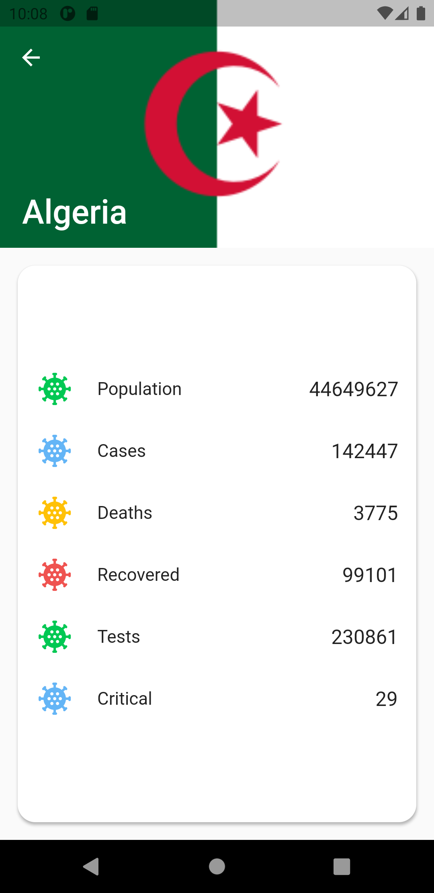

# covid_flutter_app

Aplicativo que mostra um visão de geral dos casos de covid no mundo.

## Getting Started

Faça o clone deste repositório:
```bash
git clone https://github.com/Kdiaseng/covid_flutter_app.git
```
## Screenshots

<p align="left">
   &nbsp;&nbsp;
   &nbsp;&nbsp; 
   &nbsp;&nbsp;
   &nbsp;&nbsp;
</p>

## Technologies
- MobX - [mobx 2.0.1](https://pub.dev/packages/mobx)
- Flutter Modular - [flutter_modular 3.3.0](https://pub.dev/packages/flutter_modular)
- Gerador de código MobX - [mobx_codegen: ^2.0.1+3](https://pub.dev/packages/mobx_codegen)
- Skeleton animation - [skeleton_animation: ^0.1.4](https://pub.dev/packages/skeleton_animation)
- Flutter 2.2.2
- Dart 2.13.3
